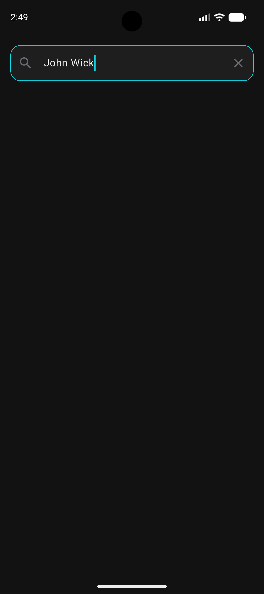
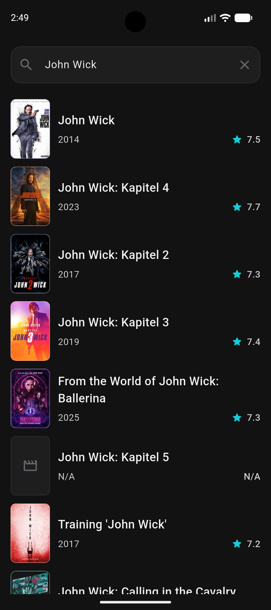
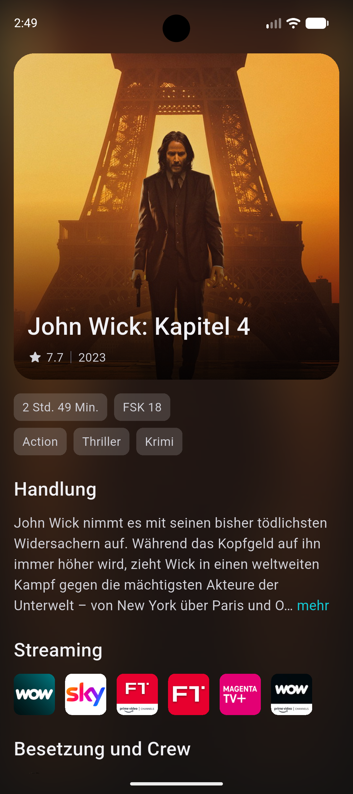
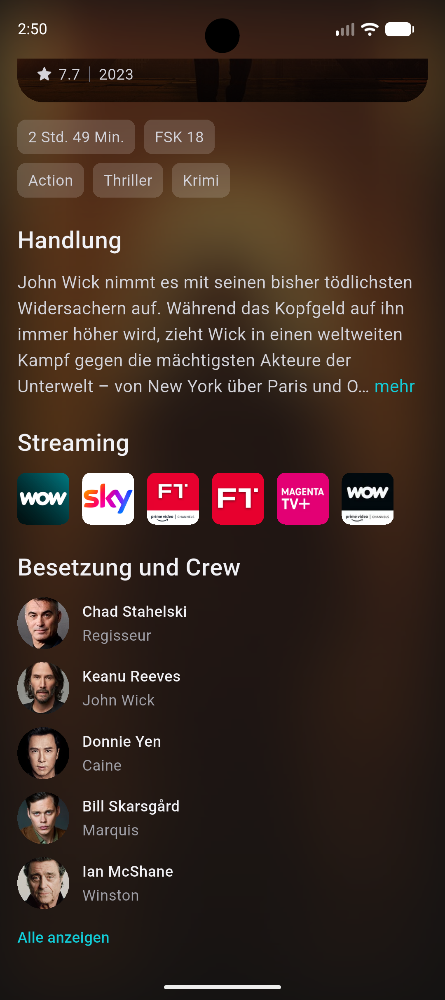

# Flutter Movie App
A movie app built with Flutter and the [TMDB API](https://www.themoviedb.org). Search for movies and see where to stream them.

## Screenshots
<p>
  
  
  
  
</p>

## Features
**Search**
- Search movies by title
- Results load automatically while scrolling
- Poster, release year and user rating for every result
- Poster frames tinted in the poster's main color

**Movie details**
- Backdrop card with title, rating and year
- Runtime, age rating (FSK) and genres
- Plot summary
- Streaming services (subscription only)
- Director and cast
- Blurred backdrop as page background

## Getting started
1. Get a free API key at [themoviedb.org](https://www.themoviedb.org/settings/api).
2. Create the file `lib/api/api_key.dart`:

   ```dart
   class ApiKey {
     static const String apiKey = 'YOUR_API_KEY';
   }
   ```
3. Run the app:

   ```
   flutter pub get
   flutter run
   ```

## API Documentation
https://developer.themoviedb.org/docs

## Credits
Data provided by [The Movie Database](https://www.themoviedb.org).  
Watch providers provided by [JustWatch](https://www.justwatch.com/).


This product uses the TMDB API but is not endorsed or certified by TMDB.
