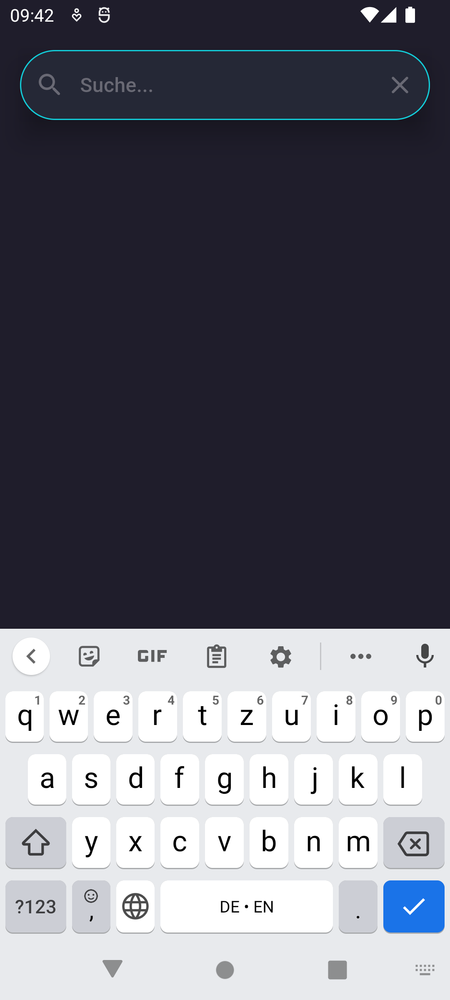
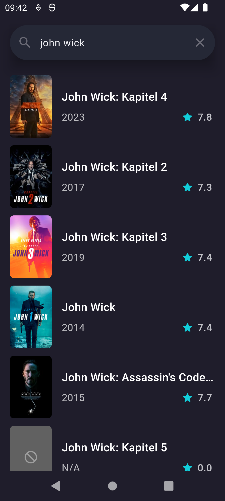

# Flutter Movie App
A movie app build with Flutter and the [TMDB API](https://www.themoviedb.org).

## Screenshots

  
  
  

## Features

## To Do's
- [x] UI design
- [x] Search page
- [x] Details page
- [x] Availability on streaming services
- [ ] Start page
- [ ] Watchlist
- [ ] Add own API key via UI
- [ ] Dark mode / light mode
- [ ] Create own lists
- [ ] Share movies / lists

## API Documentation
https://developer.themoviedb.org/docs

## Credits
Data provided by [The Movie Database](https://www.themoviedb.org).  
Watch Providers provided by [JustWatch](https://www.justwatch.com/).

